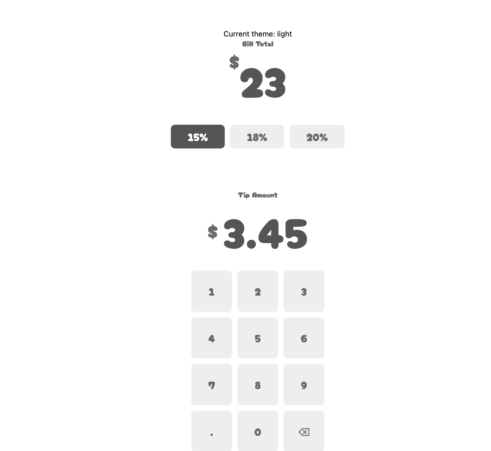
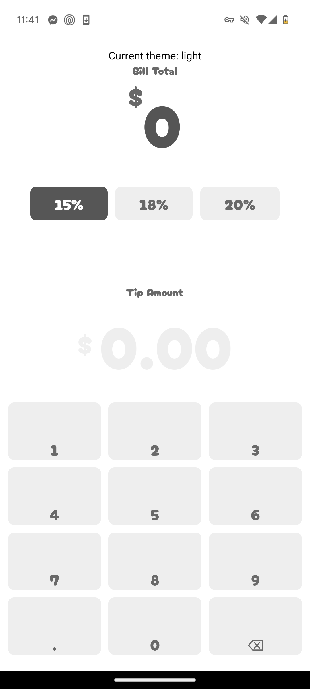

# Tip Calculator App

A React Native tip calculator app built with Expo. Currently facing an issue with text alignment in number pad buttons on Android.

## The Issue

The number pad buttons show different vertical text alignment between web and Android:
- On web: Numbers are properly centered in buttons
- On Android (Expo Go): Numbers appear aligned to the bottom of buttons

## Screenshots
### Web Version (Centered Numbers)


### Android Version (Bottom-Aligned Numbers)


## Questions
1. Why does the text alignment behave differently between web and Android?
2. What's the best approach to achieve consistent centering across platforms?

## Current Style Implementation
```typescript
bottomSection: {
    flex: 0.4,
    alignItems: 'center',
    justifyContent: 'center',
}, 

numberPad: {
    flex: 1,
    flexDirection: 'row',
    flexWrap: 'wrap',
    justifyContent: 'center',
    gap: 10,
},

numberButton: {
    width: '30%',
    aspectRatio: 1,
    alignItems: 'center',
    justifyContent: 'center',
    backgroundColor: colors.backgroundSecondary,
    borderRadius: 8,
},

numberText: {
    fontFamily: 'CherryBomb',
    fontSize: 20,
    color: colors.textSecondary,
    textAlign: 'center'
}
```


## How to Test

1. Clone and run the project:
```bash
git clone https://github.com/YOUR_USERNAME/tip-calculator.git
cd tip-calculator
npm install
npx expo start
```


2. Test on:
- Web browser: `w` - Numbers appear centered
- Android (Expo Go): `a` - Numbers appear at bottom of buttons

## Environment
- Expo SDK: 52.0.25
- React Native: 0.76.6
- Platform tested: Android (Expo Go)
